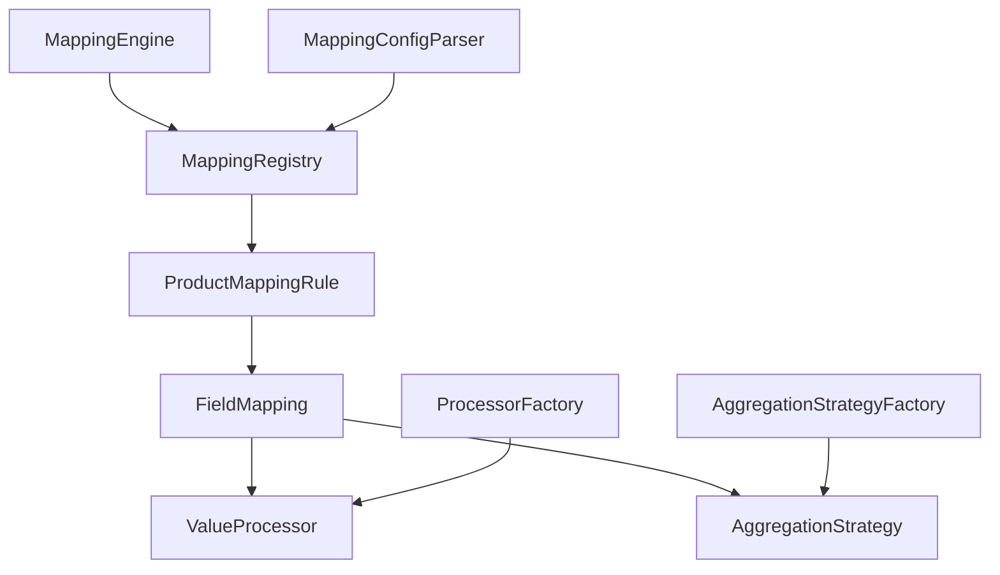
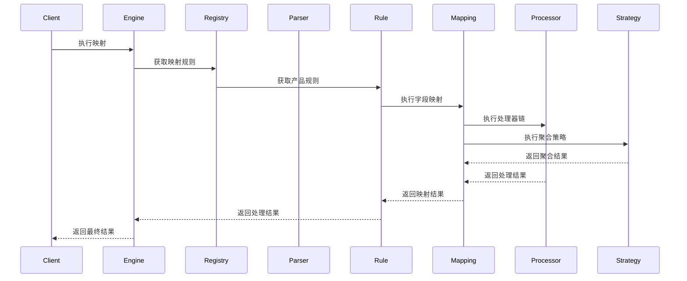

# 数据映射转换工具

## 项目介绍

这是一个灵活的数据映射转换工具，支持复杂的 JSON 数据转换、字段处理和数据聚合。该工具可以处理多层嵌套的 JSON 数据，支持自定义字段处理器和聚合策略，适用于各种数据转换场景。

### 主要特性

- 支持复杂的 JSON 路径表达式
- 提供丰富的字段处理器（格式化、转换、计算等）
- 支持多种聚合策略（求和、平均值、最大值等）
- 可扩展的处理器和聚合策略机制
- 详细的日志记录和错误处理
- 支持配置化的映射规则

## 系统架构

### 核心组件



### 数据流转图



## 快速开始

### 1. 环境要求

- JDK 1.8+
- Maven 3.6+

### 2. 项目配置

```xml
<dependency>
    <groupId>com.aliang</groupId>
    <artifactId>data-mapping</artifactId>
    <version>1.0.0</version>
</dependency>
```

### 3. 基本使用

```java
// 1. 创建映射配置
String configJson = "{\n" +
    "  \"productCode\": \"A001\",\n" +
    "  \"mappings\": [\n" +
    "    {\n" +
    "      \"sourcePath\": \"$.user.name\",\n" +
    "      \"targetPath\": \"$.profile.fullName\",\n" +
    "      \"processors\": [\"uppercase\"]\n" +
    "    }\n" +
    "  ]\n" +
    "}";

// 2. 初始化组件
MappingRegistry registry = new MappingRegistry();
MappingConfigParser parser = new MappingConfigParser(new ProcessorFactory(), registry);
parser.parseAndRegister(JSON.parseObject(configJson), registry);
MappingEngine engine = new MappingEngine(registry);

// 3. 执行映射
JSONObject source = JSON.parseObject("{\"user\":{\"name\":\"张三\"}}");
JSONObject target = JSON.parseObject("{\"profile\":{\"fullName\":\"\"}}");
JSONObject result = engine.map(source, target, "A001");
```

## 配置说明

### 1. 映射规则配置

```json
{
  "productCode": "A001",
  "mappings": [
    {
      "sourcePath": "$.user.name",
      "targetPath": "$.profile.fullName",
      "processors": ["uppercase"],
      "aggregationStrategies": ["first"]
    }
  ]
}
```

### 2. 支持的处理器

| 处理器名称 | 说明 | 示例 |
|------------|------|------|
| uppercase | 转大写 | `"processors": ["uppercase"]` |
| lowercase | 转小写 | `"processors": ["lowercase"]` |
| dateFormat | 日期格式化 | `"processors": ["dateFormat:yyyy-MM-dd"]` |
| roundTwoDecimal | 四舍五入到两位小数 | `"processors": ["roundTwoDecimal"]` |
| booleanToYesNo | 布尔值转是/否 | `"processors": ["booleanToYesNo"]` |
| mapValue | 值映射 | `"processors": ["mapValue:1=已发货;2=已取消"]` |

### 3. 支持的聚合策略

| 策略名称 | 说明 | 示例 |
|----------|------|------|
| sum | 求和 | `"aggregationStrategies": ["sum"]` |
| average | 平均值 | `"aggregationStrategies": ["average"]` |
| max | 最大值 | `"aggregationStrategies": ["max"]` |
| min | 最小值 | `"aggregationStrategies": ["min"]` |
| first | 第一个值 | `"aggregationStrategies": ["first"]` |
| last | 最后一个值 | `"aggregationStrategies": ["last"]` |

## 高级特性

### 1. 自定义处理器

```java
public class CustomProcessor implements ValueProcessor {
    @Override
    public Object doProcess(Object value) {
        // 实现自定义处理逻辑
        return processedValue;
    }
}
```

### 2. 自定义聚合策略

```java
public class CustomStrategy implements AggregationStrategy {
    @Override
    public Object apply(List<?> values) {
        // 实现自定义聚合逻辑
        return aggregatedValue;
    }
}
```

### 3. 复杂嵌套示例

```json
{
  "productCode": "DEEP001",
  "mappings": [
    {
      "sourcePath": "$.data.level1[*].level2[*].name",
      "targetPath": "$.result.users[0].fullName",
      "processors": ["uppercase", "prefix:USER_"]
    },
    {
      "sourcePath": "$.data.level1[*].level2[*].orders[*].amount",
      "targetPath": "$.result.statistics.totalAmount",
      "aggregationStrategies": ["sum"],
      "processors": ["roundTwoDecimal"]
    }
  ]
}
```

## 最佳实践

1. **路径表达式**
   - 使用 `$` 表示根节点
   - 使用 `.` 访问对象属性
   - 使用 `[*]` 访问数组元素
   - 使用 `[?(@.field == value)]` 进行条件过滤

2. **处理器链**
   - 处理器按配置顺序执行
   - 聚合策略在处理器之前执行
   - 合理组合处理器和聚合策略

3. **错误处理**
   - 使用 try-catch 捕获异常
   - 检查无效字段和处理器
   - 记录详细的处理日志

## 常见问题

1. **Q: 如何处理空值？**
   A: 系统会自动跳过空值，不会影响其他字段的处理。

2. **Q: 如何调试映射问题？**
   A: 查看日志输出，系统会记录每个处理步骤的输入和输出。

3. **Q: 支持哪些数据格式？**
   A: 主要支持 JSON 格式，输入输出都是 JSONObject。

## 贡献指南

1. Fork 项目
2. 创建特性分支
3. 提交变更
4. 推送到分支
5. 创建 Pull Request

## 许可证

MIT License

## 使用示例

### 1. 基础字段映射

```json
// 配置
{
  "productCode": "BASIC001",
  "mappings": [
    {
      "sourcePath": "$.user.name",
      "targetPath": "$.profile.fullName",
      "processors": ["uppercase"]
    }
  ]
}

// 输入数据
{
  "user": {
    "name": "张三"
  }
}

// 输出结果
{
  "profile": {
    "fullName": "张三"
  }
}
```

### 2. 日期格式化

```json
// 配置
{
  "productCode": "DATE001",
  "mappings": [
    {
      "sourcePath": "$.order.createTime",
      "targetPath": "$.orderInfo.createTime",
      "processors": ["dateFormat:yyyy年MM月dd日 HH:mm:ss"]
    }
  ]
}

// 输入数据
{
  "order": {
    "createTime": "2024-03-21 15:45:00"
  }
}

// 输出结果
{
  "orderInfo": {
    "createTime": "2024年03月21日 15:45:00"
  }
}
```

### 3. 数值计算和格式化

```json
// 配置
{
  "productCode": "NUMBER001",
  "mappings": [
    {
      "sourcePath": "$.order.items[*].price",
      "targetPath": "$.orderSummary.totalAmount",
      "aggregationStrategies": ["sum"],
      "processors": ["roundTwoDecimal"]
    }
  ]
}

// 输入数据
{
  "order": {
    "items": [
      {"price": 100.654},
      {"price": 200.752}
    ]
  }
}

// 输出结果
{
  "orderSummary": {
    "totalAmount": 301.41
  }
}
```

### 4. 布尔值转换

```json
// 配置
{
  "productCode": "BOOLEAN001",
  "mappings": [
    {
      "sourcePath": "$.user.isVip",
      "targetPath": "$.userInfo.vipStatus",
      "processors": ["booleanToYesNo"]
    }
  ]
}

// 输入数据
{
  "user": {
    "isVip": true
  }
}

// 输出结果
{
  "userInfo": {
    "vipStatus": "是"
  }
}
```

### 5. 值映射转换

```json
// 配置
{
  "productCode": "MAP001",
  "mappings": [
    {
      "sourcePath": "$.order.status",
      "targetPath": "$.orderInfo.statusText",
      "processors": ["mapValue:1=已发货;2=已取消;3=已完成"]
    }
  ]
}

// 输入数据
{
  "order": {
    "status": 1
  }
}

// 输出结果
{
  "orderInfo": {
    "statusText": "已发货"
  }
}
```

### 6. 复杂嵌套数据转换

```json
// 配置
{
  "productCode": "COMPLEX001",
  "mappings": [
    {
      "sourcePath": "$.data.users[*].name",
      "targetPath": "$.result.userList[*].fullName",
      "processors": ["uppercase", "prefix:USER_"]
    },
    {
      "sourcePath": "$.data.users[*].orders[*].amount",
      "targetPath": "$.result.statistics.totalAmount",
      "aggregationStrategies": ["sum"],
      "processors": ["roundTwoDecimal"]
    },
    {
      "sourcePath": "$.data.users[*].orders[*].createTime",
      "targetPath": "$.result.statistics.lastOrderTime",
      "aggregationStrategies": ["last"],
      "processors": ["dateFormat:yyyy年MM月dd日 HH:mm:ss"]
    }
  ]
}

// 输入数据
{
  "data": {
    "users": [
      {
        "name": "张三",
        "orders": [
          {
            "amount": 100.654,
            "createTime": "2024-03-20 10:30:55"
          },
          {
            "amount": 200.752,
            "createTime": "2024-03-21 15:45:00"
          }
        ]
      }
    ]
  }
}

// 输出结果
{
  "result": {
    "userList": [
      {
        "fullName": "USER_张三"
      }
    ],
    "statistics": {
      "totalAmount": 301.41,
      "lastOrderTime": "2024年03月21日 15:45:00"
    }
  }
}
```

### 7. 条件过滤示例

```json
// 配置
{
  "productCode": "FILTER001",
  "mappings": [
    {
      "sourcePath": "$.orders[?(@.status == 'completed')].amount",
      "targetPath": "$.summary.completedAmount",
      "aggregationStrategies": ["sum"],
      "processors": ["roundTwoDecimal"]
    }
  ]
}

// 输入数据
{
  "orders": [
    {
      "status": "completed",
      "amount": 100.50
    },
    {
      "status": "processing",
      "amount": 200.75
    },
    {
      "status": "completed",
      "amount": 300.25
    }
  ]
}

// 输出结果
{
  "summary": {
    "completedAmount": 400.75
  }
}
```

### 8. 多处理器链示例

```json
// 配置
{
  "productCode": "CHAIN001",
  "mappings": [
    {
      "sourcePath": "$.product.name",
      "targetPath": "$.productInfo.displayName",
      "processors": [
        "uppercase",
        "prefix:PRODUCT_",
        "suffix:_2024"
      ]
    }
  ]
}

// 输入数据
{
  "product": {
    "name": "测试商品"
  }
}

// 输出结果
{
  "productInfo": {
    "displayName": "PRODUCT_测试商品_2024"
  }
}
``` 