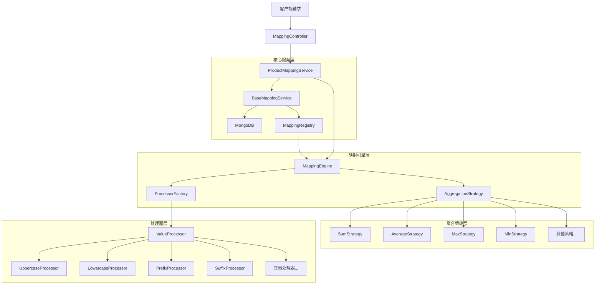

# 系统架构图

## 说明

1. **客户端层**
    - 通过`MappingController`接收和处理HTTP请求
    - 提供RESTful API接口

2. **核心服务层**
    - `ProductMappingService`: 主要业务逻辑处理
    - `BaseMappingService`: 基础服务功能
    - `MappingRegistry`: 映射规则注册中心
    - MongoDB: 配置存储

3. **映射引擎层**
    - `MappingEngine`: 核心映射引擎
    - `ProcessorFactory`: 处理器工厂
    - `AggregationStrategy`: 聚合策略接口

4. **处理器层**
    - 各种数据转换处理器
    - 支持字符串处理、数值处理等
    - 可扩展的处理器机制

5. **聚合策略层**
    - 数组数据聚合策略
    - 支持求和、平均值、最大值、最小值等
    - 可扩展的策略机制 