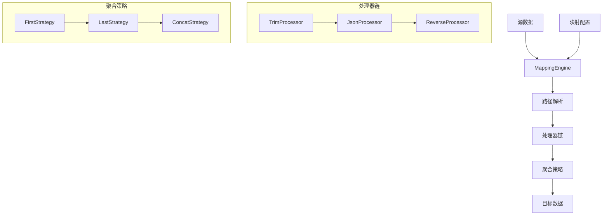

# 数据流图

## 说明

1. **数据输入**
    - 源数据：包含需要映射的原始数据
    - 映射配置：定义数据转换规则

2. **处理流程**
    - 路径解析：根据配置解析源数据路径
    - 处理器链：按顺序应用多个处理器
    - 聚合策略：处理多个值的聚合方式

3. **处理器类型**
    - TrimProcessor：去除字符串首尾空格
    - JsonProcessor：转换为JSON字符串
    - ReverseProcessor：字符串反转

4. **聚合策略**
    - FirstStrategy：取第一个值
    - LastStrategy：取最后一个值
    - ConcatStrategy：连接所有值

5. **数据输出**
    - 目标数据：经过完整处理后的映射结果 