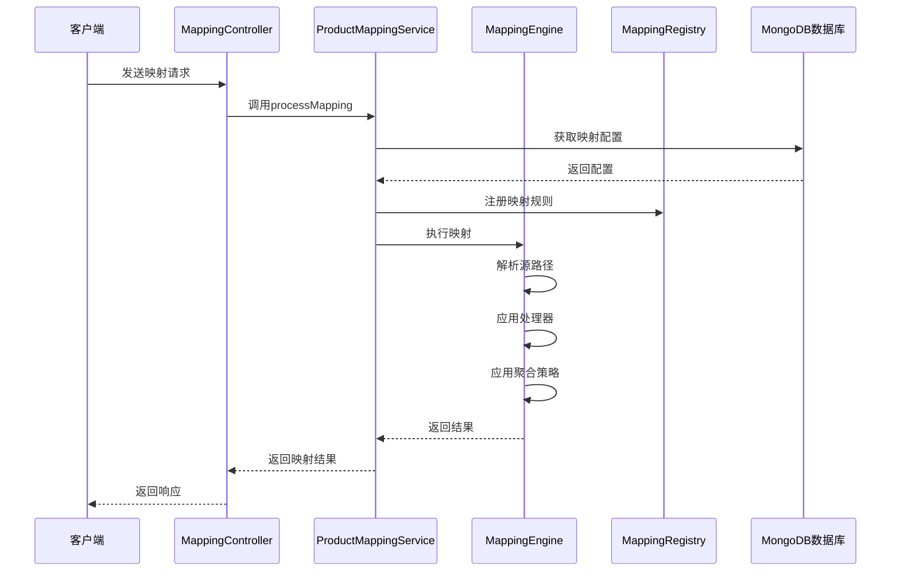

# 时序图

## 说明

1. **请求发起**
    - 客户端发送映射请求到`MappingController`
    - 请求包含产品编码、源数据和目标模板

2. **配置获取**
    - `ProductMappingService`从MongoDB获取映射配置
    - 配置包含字段映射规则、处理器和聚合策略

3. **规则注册**
    - 将解析后的配置注册到`MappingRegistry`
    - 注册中心维护产品编码到映射规则的映射关系

4. **映射执行**
    - `MappingEngine`执行实际的映射操作
    - 按顺序执行：路径解析、处理器应用、聚合策略应用

5. **结果返回**
    - 映射结果通过服务层返回给控制器
    - 控制器将结果封装后返回给客户端 